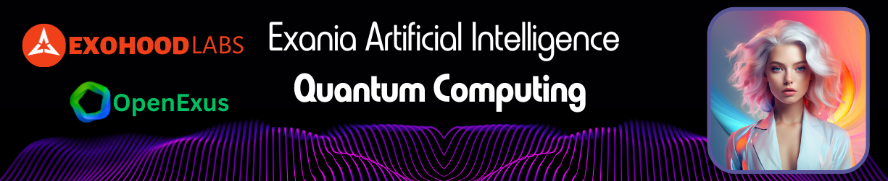

# Exania Quantum Computing Integration

# Overview

This repository is dedicated to the groundbreaking integration of quantum computing with Exania, our sophisticated AI system. This project explores the theoretical underpinnings and practical applications of quantum computing in augmenting Exania's prowess in areas such as deep learning, machine learning, and secure data transmission to blockchain platforms.

# Key Features

1. **Quantum-Enhanced AI Processing**: Leveraging quantum computing's potential to boost Exania's data processing and analysis capabilities far beyond the limits of traditional computing.
2. **Accelerated Learning and Reasoning**: Utilizing quantum algorithms to enhance the speed and efficiency of AI model development and training processes.
3. **Secure Blockchain Integration**: Implementing quantum resistant encryption to safeguard data transmission between Exania and blockchain networks.

## Programming Languages and Technologies

Working on this repository requires familiarity with the following languages and technologies:

- **Python**: For general purpose programming and integration with AI frameworks.
- **Qiskit**: IBM's open-source quantum computing framework, used for implementing quantum algorithms.
- **TensorFlow Quantum**: For blending quantum computing techniques with TensorFlow's machine learning models.
- **Solidity**: Essential for creating and managing smart contracts on blockchain platforms like Ethereum.
- **C++ (Optional)**: For performance critical components of the system.

## Enhancements in AI Processing and Blockchain Integration

The integration of quantum computing in the Exania system significantly enhances speed, language processing, and data storage capabilities. This advancement allows for addressing complexities that are beyond the capabilities of standard servers. The impact of these enhancements is particularly notable in a range of fields, including space research, software development, internet technologies, satellite technology, healthcare, food research, veganism studies, cocoa research, and climate change studies.

Quantum computing's ability to process large volumes of data at unprecedented speeds and its unique approach to data encryption and security make it an invaluable asset in these diverse areas. This technology is set to revolutionize how we approach complex problems and data intensive research in these critical sectors.

1. **Enhanced Speed and Processing Efficiency**

**Quantum Speed up**

* Formula: Let Tqc be the time taken by quantum computing algorithms and Tcc be the time taken by classical computing algorithms for the same task. The speed up 
S is given by:
```math
  S = \frac{T_{cc}}{T_{qc}}
```
This formula demonstrates the significant reduction in processing time achieved through quantum computing.
​	
**Application in Complex Areas**

Quantum computing addresses multi dimensional problems in space research and climate modeling by leveraging its ability to process vast datasets exponentially faster than traditional computing.

2. **Advanced Language Processing**

Quantum computing significantly enhances language processing capabilities, crucial for areas like healthcare and software development.

## Quantum Natural Language Processing (QNLP)

Quantum Entanglement and Language Models: Quantum entanglement allows for the representation of complex language models, capturing nuances and context more effectively than classical models.

Application in Diverse Fields

QNLP can revolutionize veganism studies and food research by analyzing large volumes of textual data for patterns and insights that are not discernible through classical computing methods.

3. **Quantum Secure Blockchain Storage**

**Quantum Encryption for Data Storage**

Formula: The security level L of quantum encryption can be represented as:

```math
L = 2^n
```

Where n is the number of qubits used. This ensures a significantly higher security level for blockchain databases.
Application in Sensitive Data Areas in healthcare and satellite technology, where data security is paramount, quantum secure blockchain storage offers an unbreakable layer of protection against cyber threats.

## Installation and Setup

1. **Clone the Repository**: Use Git to clone the repository to your local machine.
2. **Install Dependencies**: Ensure that you have Python, Qiskit, TensorFlow Quantum, and other necessary libraries installed.
3. **Documentation**: Refer to the included documentation for detailed instructions on setting up and integrating the system.

## Contribution Guidelines

Contributors are encouraged to:

1. **Fork the Repository**: Make a fork and work on your innovative features or improvements.
2. **Adhere to Coding Standards**: Follow best practices and coding standards for each language used.
3. **Pull Requests**: Submit pull requests for review and inclusion in the main repository.
4. **Collaboration**: Engage with the community for guidance, suggestions, and discussions.
